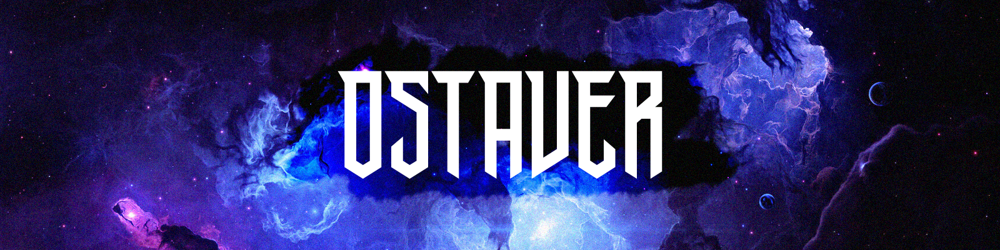

  

# Hi, I'm Filip aka *OSTAVER*

> Full Stack Web Developer & Creative Technologist. Lover of creativity and chaos.
> Building high-performance web systems, among many other things.

Website: **[OSTAVER](https://ostaver.com)**

---

## About Me

- Currently developing **[Sharp-design](https://sharp.ostaver.com)** — a design system and component skill library built for AI agents.
- Experimenting with **GLSL shaders, WebGL, and generative web UI**.
- Part-time music producer & sound designer (DAW: FL Studio). Lover of creativity and deliberate chaos.
- Deeply interested in **Cognitive Science, Psychology, and AI architectures**.
- Current lifelong goal: `Visit outer space`.
- Fun fact: I don't drink coffee, I skip parties, and I spend my nights writing code and tuning Mayhem.

---

## Tech Stack

**Frontend & Graphics**  

**Backend & Data**  

**DevOps & Infrastructure**  

**Creativity**  

---

## Featured Projects

| Project | Description | Stack | Links |
| :--- | :--- | :--- | :--- |
| **[Sharp-design](https://github.com/ostaver/Sharp-design)** | Design system and component skill library built for AI agents | TypeScript, CSS Architecture, Node.js | [Repo](https://github.com/ostaver/Sharp-design) · [Live Demo](https://sharp.ostaver.com) |
| **[Sharp-shaders](https://github.com/ostaver/Sharp-shaders)** | Production-ready, elegant GLSL & WebGL shaders for web use | WebGL, GLSL, Three.js | [Repo](https://github.com/ostaver/Sharp-shaders) |
| **[Sharp-docs](https://github.com/ostaver/Sharp-docs)** | Retrieval-Augmented Generation (RAG) document analyzer | Next.js, Gemini API, AI Integration | [Repo](https://github.com/ostaver/Sharp-docs) |

---

## Connect & Collaborate🤝

Always open to discussing web engineering, generative visuals, music production, or AI agent interfaces.

- **Email: filipkaramazov@ostaver.com** 
- **Website:** [ostaver.com](https://ostaver.com)
